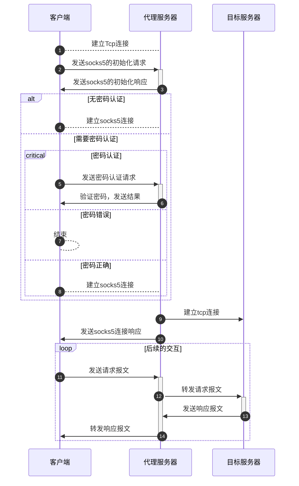

# 用Netty实现Trojan（二）"


# 用Netty实现Trojan（二）

本节主要是介绍如何实现一个允许tcp通过的socks代理服务器，大部分携带网络功能的客户端，如curl、wget、浏览器等，在请求的时候，可以通过环境变量或者设置的形式，使这些客户端通过代理进行请求，以下是一个简单的例子：

```shell
export https_proxy=socks5://127.0.0.1:1080 # 设置https使用socks5代理
curl -v https://www.google.com # 进行一次https的请求
```

在实现trojan协议之前，我们首先需要实现一个socks5代理服务端，用以在客户端中使用。

本文目前参照Netty官方的socks5实现，实现了一个socks代理服务器，由于大部分客户端都已经同时兼容socks4和socks5，此处仅实现socks5协议，socks5协议支持tcp、udp连接方式，但此处只实现了socks5的tcp代理。

## 参考

- [Netty/Netty socks example](https://github.com/Netty/Netty/tree/4.1/example/src/main/java/io/Netty/example/socksproxy)
- [socks wiki](https://zh.wikipedia.org/wiki/SOCKS)

## 时序图

socks5的tcp代理，大致时序如下：



## 实现

### 初始化通道

初始化通道采用Netty的`SocksPortUnificationServerHandler`
，在这个handler中，会将首个请求，按照socks4或者socks5的协议进行解析，解析结果`SocksMessage`
对象。此段对应上面时序图中建立Tcp连接和发送socks5的初始化请求部分的处理。这部分都是Netty内部的解码器已经实现了，这部分主要是将这部分组合起来，连同Netty自身启动一起介绍。

#### 启动Netty部分

```kotlin
ServerBootstrap().group(bossGroup, workerGroup)
    .channel(NioServerSocketChannel::class.java)
    .childHandler(ProxyChannelInitializer()) //此处定义一个通道初始化器，用于后续根据业务逻辑来初始化pipeline等信息
    .bind(inbound.port)
```

#### 通道管线初始化

```kotlin
//...
class ProxyChannelInitializer : ChannelInitializer<NioSocketChannel>() {
    //...
    override fun initChannel(ch: NioSocketChannel) {
        //...
        initSocksInbound(ch, inbound)
        return
        //...
    }
    private fun initSocksInbound(ch: NioSocketChannel, inbound: Inbound) {
        ch.pipeline().addLast(SocksPortUnificationServerHandler()) //在此处添加socks协议初始化的协议解析器
        //...
    }
    //...
}

```

### socks5的认证报文处理

由于socks5的认证处理部分是建议自定义的，Netty仅提供了大致的结构实现，具体如何去认证，由开发者自己实现。此处，我们需要实现一个免密认证和账号密码认证。在三一部分的初始化过程中，客户端发送的tcp数据包，已经由`SocksPortUnificationServerHandler`
转化为`SocksMessage`对象，此处我们创建一个`SimpleChannelInboundHandler`的实现类，泛型指定为`SocksMessage`，用以处理socks5的认证请求。

在认证请求处理完成后，代理服务前会从当前的初始化-认证处理阶段进入到命令报文的处理阶段，此时，我们需要将`SocksServerHandler`
从pipeline中移除，添加`SocksServerConnectHandler`，用以处理后续的命令报文。这一段在下文的注释3中有说明。

在认证过程的处理中，我们分两个步骤进行，第一个步骤接受到的是socks5的初始数据包，数据包格式如下：

| --  | VER | NMETHODS | METHODS |
|-----|-----|----------|---------|
| 字节数 | 1   | 1        | 1~255   |

+ VER：socks版本，此处为5（在以下代码`注释1`中，有用到此信息进行版本判断）
+ NMETHODS：METHODS的长度（这部分是在`SocksPortUnificationServerHandler`已经自动处理）
+ METHODS：METHODS的内容，METHODS的内容为1~
  255的数字，代表认证方式，0x00代表无密码认证，0x02代表账号密码认证（在本段代码中，只是想实现这两种认证方式，其他的认证方式，可以参考socks5协议文档自行实现）

服务器从客户端提供的方法中选择一个并通过以下消息通知客户端：

| --  | VER | METHOD |
|-----|-----|--------|
| 字节数 | 1   | 1      |

+ VER：socks版本，此处为5
+
METHOD：METHODS的内容，其中选一个进行返回，如果没有一个认证方式，可以进行返回0xFF，此处我们只实现了0x00和0x02，所以返回0x00或者0x02（在`注释2`
处，根据项目配置信息，会选择返回无密码认证或者有密码认证）

SOCKS5 用户名密码认证方式
在客户端、服务端协商使用用户名密码认证后，客户端发出用户名密码，格式为

| --  | VER | ULEN | UNAME | PLEN | PASSWD |
|-----|-----|------|-------|------|--------|
| 字节数 | 1   | 1    | 1~255 | 1    | 1~255  |

+ VER：鉴定协议版本目前为 0x01
+ ULEN：UNAME 长度，1 字节
+ UNAME：用户名
+ PLEN：PASSWD 长度，1 字节
+ PASSWD：密码

服务器鉴定后发出如下回应（）：

| --  | VER | STATUS |
|-----|-----|--------|
| 字节数 | 1   | 1      |

+ VER：鉴定协议版本目前为 0x01
+ STATUS：鉴定状态，0x00 表示成功，0x01 表示失败。

其中鉴定状态 0x00 表示成功，0x01 表示失败。

```kotlin
class SocksServerHandler(private val inbound: Inbound) : SimpleChannelInboundHandler<SocksMessage>() {
    //...
    //用以标记此通道是否已经认证
    private var authed = false

    public override fun channelRead0(ctx: ChannelHandlerContext, socksRequest: SocksMessage) {
        when (socksRequest.version()!!) {//注释1，此处为socks版本判断
            SocksVersion.SOCKS5 -> socks5Connect(ctx, socksRequest)
            else -> {
                ctx.close()
            }
        }
    }

    /**
     * socks5 connect
     */
    private fun socks5Connect(ctx: ChannelHandlerContext, socksRequest: SocksMessage) {
        //...
        when (socksRequest) {
            is Socks5InitialRequest -> {
                socks5auth(ctx)
            }

            is Socks5PasswordAuthRequest -> {
                socks5DoAuth(socksRequest, ctx)
            }

            is Socks5CommandRequest -> {
                if (inbound.socks5Setting?.auth != null || !authed) {
                    ctx.close()
                }
                if (socksRequest.type() === Socks5CommandType.CONNECT) {
                    //注释3，在客户端直接发送Socks5CommandRequest请求时，已经不需要SocksServerHandler进行处理了，所以需要将SocksServerHandler从pipeline中移除，添加SocksServerConnectHandler
                    ctx.pipeline().addLast(SocksServerConnectHandler(inbound))
                    ctx.pipeline().remove(this)
                    ctx.fireChannelRead(socksRequest)
                } else {
                    ctx.close()
                }
            }

            else -> {
                ctx.close()
            }
        }
    }

    /**
     * socks5 auth
     * 注释2，此处根据配置信息，选择返回无密码认证或者有密码认证
     */
    private fun socks5auth(ctx: ChannelHandlerContext) {
        if (inbound.socks5Setting?.auth != null) {
            ctx.pipeline().addFirst(Socks5PasswordAuthRequestDecoder())//有密码认证的情况下，添加密码认证报文解析器
            ctx.write(DefaultSocks5InitialResponse(Socks5AuthMethod.PASSWORD)) //返回有密码认证
        } else {
            authed = true
            ctx.pipeline()
                .addFirst(Socks5CommandRequestDecoder())//有密码认证的情况下，添加命令报文的解析器，此解析器将socks5连接过程中的报文解析为Socks5CommandRequest对象
            ctx.write(DefaultSocks5InitialResponse(Socks5AuthMethod.NO_AUTH)) //返回无密码认证
        }
    }

    /**
     * socks5 auth
     * 此处进行了密码认证，如果认证失败，则关闭连接
     */
    private fun socks5DoAuth(socksRequest: Socks5PasswordAuthRequest, ctx: ChannelHandlerContext) {
        if (inbound.socks5Setting?.auth?.username != socksRequest.username()
            || inbound.socks5Setting?.auth?.password != socksRequest.password()
        ) {
            logger.warn("socks5 auth failed from: ${ctx.channel().remoteAddress()}")
            ctx.write(DefaultSocks5PasswordAuthResponse(Socks5PasswordAuthStatus.FAILURE))
            ctx.close()
            return
        }
        ctx.pipeline().addFirst(Socks5CommandRequestDecoder())
        ctx.write(DefaultSocks5PasswordAuthResponse(Socks5PasswordAuthStatus.SUCCESS))
        authed = true
    }
    //...
}
```

### socks5的命令报文处理

认证结束后客户端就可以发送请求信息。如果认证方法有特殊封装要求，请求必须按照方法所定义的方式进行封装。
SOCKS5请求格式：

| --  | VER | CMD | RSV | ATYP | DST.ADDR | DST.PORT |
|-----|-----|-----|-----|------|----------|----------|
| 字节数 | 1   | 1   | 1   | 1    | 动态       | 2        |

+ VER：SOCKS版本，此处为5
+ CMD：SOCKS命令码，1 字节，有 3 种命令码：
    + 0x01：CONNECT 命令
    + 0x02：BIND 命令
    + 0x03：UDP ASSOCIATE 命令
+ RSV：保留字，1 字节，值 0x00
+ ATYP：地址类型，1 字节，有 3 种类型：
    + 0x01：IPv4 地址
    + 0x03：域名
    + 0x04：IPv6 地址
+ DST.ADDR：目的地址，长度不定
+ DST.PORT：目的端口，2 字节

关于sock5命令报文，这里需要抽出其中有用的几个信息，分别是CMD、ATYP、DST.ADDR、DST.PORT，Netty内部提供的`Socks5CommandRequest`
对象，已经将这些信息抽取出来了，我们只需要从中获取即可。

此处仅探讨CMD=0x01的情况，即CONNECT命令，此命令在socks5协议中，是用来建立tcp连接的，根据Wikipedia对于socks5的介绍，在服务端收到命令报文，且CMD为0x01后，需要根据报文内容，即目标服务前的地址和端口，建立tcp连接，然后返回一个响应报文，响应报文格式如下：

| --  | VER | REP | RSV | ATYP | BND.ADDR | BND.PORT |
|-----|-----|-----|-----|------|----------|----------|
| 字节数 | 1   | 1   | 1   | 1    | 动态       | 2        |

+ VER：SOCKS版本，此处为5
+ REP：响应码，1 字节，有 6 种响应码：
    + 0x00：请求成功
    + 0x01：普通 SOCKS 服务器连接失败
    + 0x02：现有规则不允许连接
    + 0x03：网络不可达
    + 0x04：主机不可达
    + 0x05：连接被拒
    + 0x06：TTL 超时
    + 0x07：不支持的命令
    + 0x08：不支持的地址类型
    + 0x09：其它错误
    + 0x0A-0xFF：未定义
+ RSV：保留字，1 字节，值 0x00
+ ATYP：地址类型，1 字节，有 3 种类型：
    + 0x01：IPv4 地址
    + 0x03：域名
    + 0x04：IPv6 地址
+ BND.ADDR：绑定地址，长度不定
+ BND.PORT：绑定端口，2 字节

```kotlin
class SocksServerConnectHandler(private val inbound: Inbound) : SimpleChannelInboundHandler<SocksMessage>() {

    //...
    /**
     * socks5 command
     */
    private fun socks5Command(originCTX: ChannelHandlerContext, message: Socks5CommandRequest) {
        //...
            resolveOutbound.ifPresent { outbound ->
                    relayAndOutbound(
                        RelayAndOutboundOp(
                            originCTX = originCTX,
                            outbound = outbound,
                            odor = odor
                        ).also {relayAndOutboundOp ->
                            relayAndOutboundOp.connectEstablishedCallback = { //此处采用回调的方式，当连接建立成功后，进行回调
                                originCTX.channel().writeAndFlush( //回调的方法是向客户端发送一个连接成功的响应报文
                                    DefaultSocks5CommandResponse(
                                        Socks5CommandStatus.SUCCESS,
                                        message.dstAddrType(),
                                        message.dstAddr(),
                                        message.dstPort()
                                    )
                                ).addListener(ChannelFutureListener { //在响应报文发送完成后，移除SocksServerConnectHandler
                                    originCTX.pipeline().remove(this@SocksServerConnectHandler)
                                })
                            }
                            //...
                        }
                    )
                }
        //...
    }
}

```
至此，代码就已经能成功处理socks5代理的各种报文，并且建立了到达目标服务前的tcp连接，下一步就是将客户端的请求报文转发到目标服务前，以及将目标服务前的响应报文转发到客户端。

### 转发报文（中继Handler实现）

中继Handler的目标是将一个channel中接收到的报文，转发至另一个channel，实现方式非常简单，我们在构造函数中，将目标channel作为参数传递至handler的实现中，当handler接收到源channel发送的报文，直接调用目标channel的write，将此handler添加到socks5来自客户端的连接和到达目标服务器的连接的最后一项即可，以下是代码实现。

```kotlin
/**
 * relay from client channel to server
 */
class RelayInboundHandler(private val relayChannel: Channel, private val inActiveCallBack: () -> Unit = {}) :
    ChannelInboundHandlerAdapter() {
    //...
    override fun channelRead(ctx: ChannelHandlerContext, msg: Any) {
        if (relayChannel.isActive) {
            //...
            relayChannel.writeAndFlush(msg).addListener(ChannelFutureListener {
                //...
            })
        } else {
            //...
        }
    }
    //...
}

```

## 总结

socks5的代理实现主要是需要根据socks5的报文定义，分别实现初始化报文、认证报文、命令报文的解析，以及根据命令报文的内容，建立到达目标服务前的tcp连接，然后将客户端的请求报文转发到目标服务前，将目标服务前的响应报文转发到客户端。
