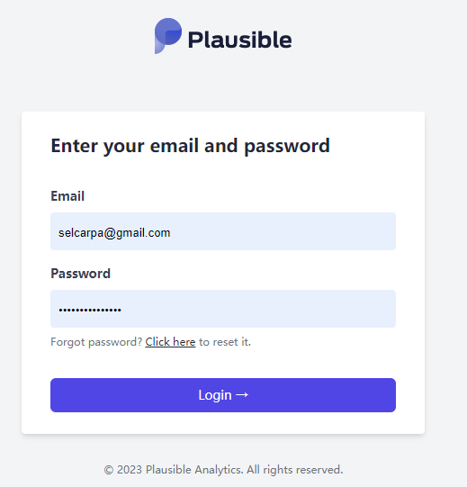
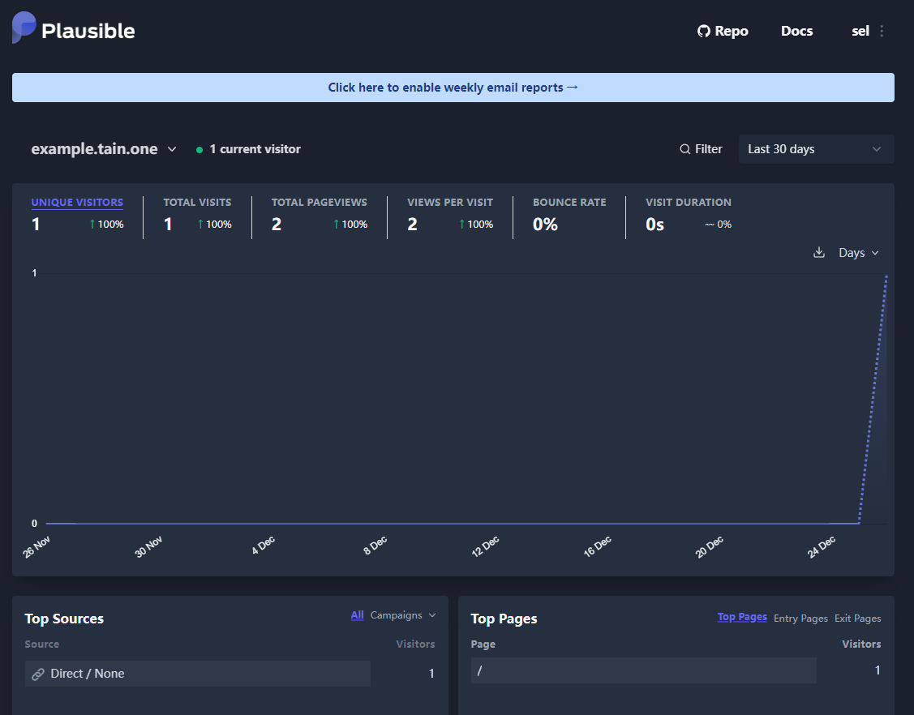

# 自托管Plausible统计静态网页访问


# 背景

- 我们需要一个统计工具，用于统计静态网页的访问量
- 不少人的浏览器会安装ublock、adblock等插件，导致一众统计服务无法统计到访问量

# Plausible

[Plausible](https://plausible.io/)是一个开源的统计工具，可以用于统计静态网页的访问量，它的特点是：

- 基于AGPLv3协议开源
- 不使用cookie，不追踪用户，不收集个人信息
- 脚本体积小，不影响网页加载速度
- 支持公开统计数据
- 支持邮件订阅统计数据

本文基于docker-compose部署Plausible，使用的是官方提供的docker镜像，部署中去除了email相关的内容。

# 环境要求

- docker-compose：安装参考[官方文档](https://docs.docker.com/compose/install/)

# 部署教程

```shell
git clone https://github.com/plausible/hosting
cd hosting
#编辑docker-compose.yml文件
vim docker-compose.yml
```

## 配置文件

```yml
version: "3.3"
services:
  # 可去除邮件相关内容
  # mail:
  #   image: bytemark/smtp
  #   restart: always

  plausible_db:
    # supported versions are 12, 13, and 14
    image: postgres:14-alpine
    restart: always
    volumes:
      - db-data:/var/lib/postgresql/data
    environment:
      - POSTGRES_PASSWORD=postgres

  plausible_events_db:
    image: clickhouse/clickhouse-server:23.3.7.5-alpine
    restart: always
    volumes:
      - event-data:/var/lib/clickhouse
      - ./clickhouse/clickhouse-config.xml:/etc/clickhouse-server/config.d/logging.xml:ro
      - ./clickhouse/clickhouse-user-config.xml:/etc/clickhouse-server/users.d/logging.xml:ro
    ulimits:
      nofile:
        soft: 262144
        hard: 262144

  plausible:
    image: plausible/analytics:v2.0
    restart: always
    command: sh -c "sleep 10 && /entrypoint.sh db createdb && /entrypoint.sh db migrate && /entrypoint.sh run"
    depends_on:
      - plausible_db
      - plausible_events_db
        # 可去除邮件相关内容
      # - mail
    ports:
      - 8000:8000
    env_file:
      - plausible-conf.env

volumes:
  db-data:
    driver: local
  event-data:
    driver: local
```

执行`docker-compose up -d`启动服务，启动后访问`http://localhost:8000`即可看到Plausible的界面。

进行账号注册



新建站点


拷贝站点js


在需要统计的静态网页中添加这段js即可,在后续的访问中，即可看到统计数据


